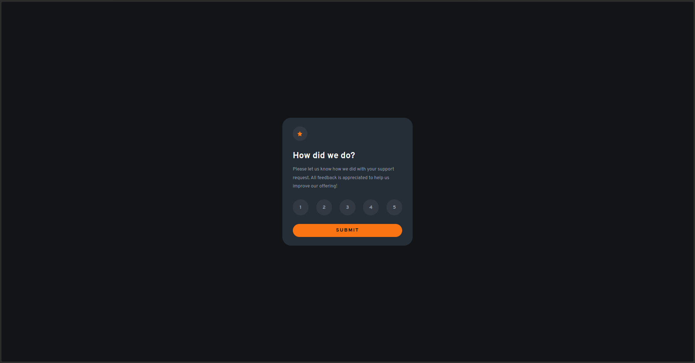

# Frontend Mentor - Interactive rating component solution

This is a solution to the [Interactive rating component challenge on Frontend Mentor](https://www.frontendmentor.io/challenges/interactive-rating-component-koxpeBUmI). 

## Table of contents

- [Overview](#overview)
  - [The challenge](#the-challenge)
  - [Screenshot](#screenshot)
  - [Links](#links)
- [My process](#my-process)
  - [Built with](#built-with)
  - [What I learned](#what-i-learned)
- [Author](#author)

## Overview

### The challenge

Users should be able to:

- View the optimal layout for the app depending on their device's screen size
- See hover states for all interactive elements on the page
- Select and submit a number rating
- See the "Thank you" card state after submitting a rating

### Screenshot

### Links

- Solution URL: [Github Repo](https://github.com/craftzniac/interactive-rating-component-FEMC)
- Live Site URL: [Live Demo](https://interactive-rating-componentttt-femc.netlify.app/)

## My process

### Built with

- CSS custom properties
- svelte
- Flexbox
- Mobile-first workflow

### What I learned
I used this project to learn about svelte.

## Author

- Frontend Mentor - [@MikeyOnyedika](https://www.frontendmentor.io/profile/MikeyOnyedika)
- Twitter - [@craftzniac](https://www.twitter.com/craftzniac)
